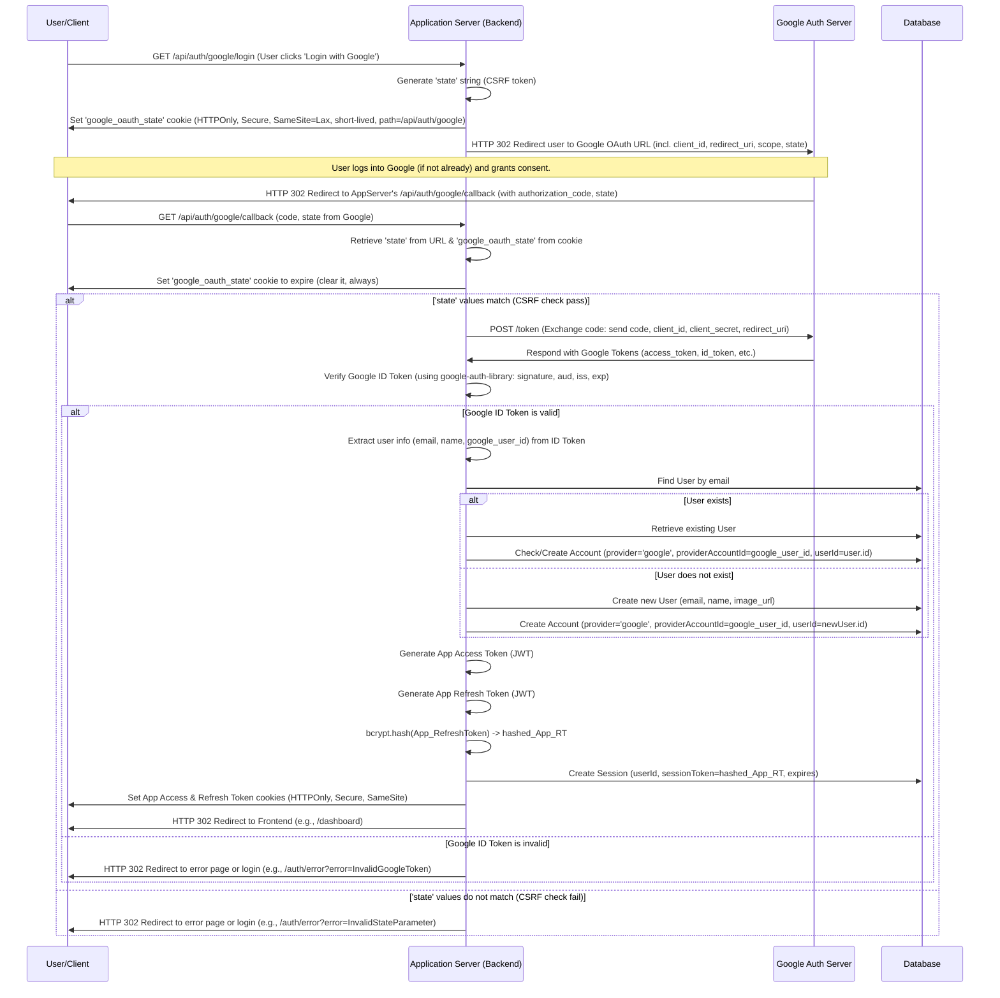

# Customer Application Authentication

This document describes the authentication mechanisms and flows implemented in the Customer application. The primary goal is to ensure secure access to user accounts and protected resources, maintaining user privacy and data integrity.

## Authentication Methods

The application supports two primary methods for user authentication, offering flexibility and convenience:

1.  **Email & Password:** This is the traditional method where users register with an email address and a password. The application securely stores a cryptographic hash of the password and uses it for verification during login.
2.  **Google OAuth 2.0:** This method allows users to sign in using their existing Google accounts. It follows the OAuth 2.0 authorization code flow, ensuring that the application never directly handles or stores the user's Google credentials.

## Core Concepts: JSON Web Tokens (JWTs)

Authentication and session management for both methods rely heavily on JSON Web Tokens (JWTs). JWTs are a compact, URL-safe means of representing claims to be transferred between two parties, typically a client and a server. The application uses two main types of JWTs for managing user sessions:

### Access Token

*   **Purpose:** The Access Token is a short-lived credential used to authorize requests to protected API endpoints. After a user successfully logs in, an Access Token is issued. This token must be included (typically via an HTTPOnly cookie automatically handled by the browser) with subsequent requests to access protected resources. The server validates the token's signature and expiration to grant access.
*   **Lifespan:** Typically very short-lived (e.g., 15 minutes). This short lifespan minimizes the potential damage if an Access Token is compromised, as it will quickly become invalid.
*   **Storage:** Stored in a secure, HTTPOnly cookie. This prevents the token from being accessed by client-side JavaScript, which is a crucial defense against Cross-Site Scripting (XSS) attacks. The browser automatically sends this cookie with requests to the application's domain.

### Refresh Token

*   **Purpose:** The Refresh Token is a longer-lived credential used to obtain a new Access Token when the current one expires. This allows users to remain logged in for extended periods without needing to re-enter their credentials frequently. When an Access Token expires, the client application can use the Refresh Token to request a new Access Token from a dedicated refresh endpoint.
*   **Lifespan:** Significantly longer-lived than Access Tokens (e.g., 7 days or as configured by application policy). Its longer life is acceptable due to the enhanced security measures applied to its handling and storage.
*   **Storage:** Also stored in a secure, HTTPOnly cookie. This cookie typically has a more restricted path (e.g., `/api/auth/refresh`) than the Access Token cookie, meaning it is only sent to the token refresh endpoint, further reducing its exposure.
*   **Security Measures:**
    *   **Hashed in Database:** The raw Refresh Token value (the JWT string itself) is **not** stored directly in the server's database. Instead, a strong cryptographic hash (using **bcrypt**) of the Refresh Token is stored in the `Session` table. This `sessionToken` (the hashed refresh token) is linked to the user's account and the session's expiration time. When a refresh attempt is made, the application hashes the received Refresh Token and compares it to the stored hashes for that user. This means that even if the database contents were compromised, attackers would not obtain usable raw Refresh Tokens.
    *   **Rotation:** Refresh Token Rotation is implemented. When a Refresh Token is successfully used to obtain a new Access Token, the used Refresh Token is invalidated (by deleting its corresponding `Session` record from the database). A brand new Refresh Token is then issued to the client along with the new Access Token. The hash of this new Refresh Token is stored in a new `Session` record. This strategy helps detect and prevent token reuse if a Refresh Token is compromised, as an attacker attempting to use a stolen token that has already been used would find it invalid. It also helps identify if a token has been stolen if an attempt is made to use an old, already rotated token by a legitimate user or an attacker.

These JWT-based mechanisms provide a stateless and scalable authentication system, enhancing both user experience and application security.

## Email/Password Authentication Flow

This flow describes the process for users authenticating via their email and password.

### 1. Registration

*   **Endpoint:** `POST /api/auth/register`
*   **Process:**
    1.  The user provides their name, email address, and a chosen password via the registration form.
    2.  The server validates the inputs (e.g., email format, password minimum length and complexity if defined).
    3.  The provided password is cryptographically hashed using **bcrypt**. This is a one-way process, meaning the original password cannot be reverse-engineered from the hash, thus ensuring it's never stored in plain text. A unique salt is automatically generated and incorporated by bcrypt for each hash.
    4.  A new `User` record is created in the database with the provided name and email. The user's email verification status might be initially set to unverified, pending a separate email verification step (if implemented).
    5.  An associated `Account` record is created. This record links the `User` ID to the hashed password and specifies the authentication `provider` as 'credentials'.
    6.  A success response is returned to the user, often prompting them to log in or, if applicable, verify their email.

### 2. Login

*   **Endpoint:** `POST /api/auth/login`
*   **Process:**
    1.  The user provides their email and password via the login form.
    2.  The server attempts to retrieve the `Account` record associated with the provided email and the 'credentials' provider. This record contains the stored hashed password and includes the associated `User` details.
    3.  If an account is found, the server compares the password provided by the user with the stored hashed password using **bcrypt.compare()**. This function securely re-hashes the input password (using the salt stored within the original hash) and compares the result to the stored hash.
    4.  If the password is valid and matches the stored hash:
        *   A new JWT **Access Token** is generated. This token includes claims such as the user's ID, email, and role, and has a short expiration time (e.g., 15 minutes).
        *   A new JWT **Refresh Token** is generated. This token typically contains the user's ID and has a longer expiration time (e.g., 7 days).
        *   The new Refresh Token (the JWT string) is then hashed using **bcrypt**. This resulting hash is stored as `sessionToken` in a new `Session` record in the database, linked to the user's ID and including the session's expiration date.
        *   Both the Access Token and the (raw, unhashed) Refresh Token are set as secure, HTTPOnly cookies in the HTTP response.
            *   The Access Token cookie is typically set with a path like `/` (making it available to all paths on the domain) and the shorter lifespan.
            *   The Refresh Token cookie is set with a more restricted path, such as `/api/auth` (making it available only for refresh and logout operations), and the longer lifespan. Both cookies should be marked `Secure` (sent only over HTTPS) and `SameSite=Lax` or `SameSite=Strict` for CSRF protection.
        *   Relevant user information (e.g., name, email, role, excluding sensitive data like the password hash) is returned in the response body, allowing the client application to update its UI and state.
    5.  If no account is found for the email, or if the password comparison fails, an appropriate error response (e.g., "Invalid credentials") is returned to prevent account enumeration.

### 3. Session Management & Token Refresh

*   **Endpoint:** `POST /api/auth/refresh`
*   **Process:**
    1.  When an Access Token expires, the client application (or its HTTP interceptor) detects this (e.g., via a 401 Unauthorized response from an API). It then makes a request to the `/api/auth/refresh` endpoint to obtain a new Access Token.
    2.  The browser automatically sends the Refresh Token to this endpoint via its secure, HTTPOnly cookie (due to the cookie's path restriction).
    3.  The server receives the Refresh Token from the cookie. It first verifies the JWT's signature and its own expiration using `jwt.verify()` with the appropriate secret key.
    4.  If the token is structurally valid and not expired by JWT standards, the server extracts the `userId` from its payload.
    5.  The server then queries the `Session` table for all active (non-expired based on the `expires` database column) sessions associated with this `userId`.
    6.  The server iterates through these fetched sessions. For each session, it uses **bcrypt.compare()** to compare the Refresh Token string received from the cookie against the hashed `sessionToken` stored in the database for that session.
    7.  If a matching, valid (i.e., `bcrypt.compare()` returns true), and database-non-expired session is found:
        *   **Refresh Token Rotation:** The found (now considered "old") `Session` record is deleted from the database. This invalidates the Refresh Token that was just used, preventing its reuse.
        *   A new JWT Access Token is generated for the user.
        *   A new JWT Refresh Token is also generated for the user.
        *   This new Refresh Token string is hashed using **bcrypt**, and this new hash is stored as `sessionToken` in a new `Session` record in the database, with a new expiration date.
        *   The new Access Token and the new (raw) Refresh Token are set as new HTTPOnly cookies in the response.
        *   A success response, potentially including the new Access Token in the body (though cookie delivery is primary for security), is sent to the client.
    8.  If no matching session is found (e.g., the token was already used and rotated, it's invalid, or the session expired in the DB), or if the JWT verification itself failed (e.g. bad signature, JWT expired), an error response is returned. The server also instructs the client to clear the (now invalid) refresh token cookie. The client should then prompt the user for re-login.

### 4. Logout

*   **Endpoint:** `POST /api/auth/logout`
*   **Process:**
    1.  The user initiates a logout action in the client application.
    2.  The client sends a request to the `/api/auth/logout` endpoint. The browser automatically includes the Refresh Token cookie with this request.
    3.  The server receives the Refresh Token from the cookie. It may verify the token's signature and extract the `userId` and the token string itself.
    4.  The server then attempts to find and delete the corresponding `Session` record from the database. This is done by fetching the user's active sessions and using `bcrypt.compare()` to find the session matching the provided Refresh Token, similar to the refresh process.
    5.  Once the session is identified and deleted, the Refresh Token is effectively invalidated on the server side.
    6.  The server sends back a response that includes instructions to clear the Access Token and Refresh Token cookies. This is typically done by setting the cookies with the same name, path, and domain, but with an expiration date in the past (e.g., `new Date(0)`).
    7.  The user is now logged out. Any subsequent attempts to access protected resources will fail, and API calls requiring a valid refresh token will also fail.

## Google OAuth 2.0 Authentication Flow

This flow allows users to authenticate using their existing Google accounts, following the OAuth 2.0 authorization code grant type. It enhances user experience by providing a familiar and often quicker sign-in option.

### 1. Initiation

*   **Trigger:** User clicks a "Sign in with Google" button or similar UI element on the client application.
*   **Client Action:** The client application redirects the user's browser to the application's backend endpoint responsible for initiating the Google OAuth flow: `GET /api/auth/google/login`.
*   **Server Endpoint (`GET /api/auth/google/login`):**
    1.  **State Generation:** The server generates a cryptographically strong, random string known as the `state` parameter. This parameter is crucial for CSRF (Cross-Site Request Forgery) protection, ensuring that the authentication response corresponds to a request initiated by this application.
    2.  **State Cookie Storage:** The generated `state` value is stored in a short-lived (e.g., 15 minutes), secure, HTTPOnly cookie (named, for example, `google_oauth_state`). This cookie is configured with `SameSite=Lax` for a balance of security and usability, and its `path` is restricted to the Google authentication callback URI's vicinity (e.g., `/api/auth/google`) to limit its scope.
    3.  **Authorization URL Construction:** The server constructs the URL for Google's OAuth 2.0 authorization endpoint (`https://accounts.google.com/o/oauth2/v2/auth`). This URL includes several important query parameters:
        *   `client_id`: The application's unique Google Client ID.
        *   `redirect_uri`: The specific URI within this application where Google will redirect the user after they have granted or denied consent (e.g., `https://your-app-domain.com/api/auth/google/callback`).
        *   `response_type=code`: Specifies that the application is requesting an authorization code (as per the Authorization Code Grant flow).
        *   `scope`: A space-delimited string defining the permissions the application is requesting from Google (e.g., `openid email profile` to get basic user identity information).
        *   `state`: The randomly generated `state` string from step 1.
    4.  **Redirect to Google:** The server issues an HTTP redirect response (status 302) that directs the user's browser to the constructed Google OAuth URL. The `Set-Cookie` header for the `state` cookie is included in this response.

### 2. User Consent & Redirection from Google

1.  The user's browser is redirected to Google's servers. If the user is not already logged into their Google account, Google will prompt them to log in.
2.  Google's consent screen is then displayed, asking the user to grant the application permission to access the information specified in the `scope` parameter (e.g., their email address and profile information).
3.  If the user grants consent, Google redirects their browser back to the `redirect_uri` that was specified by the application in the initiation step. This redirect includes:
    *   An authorization `code` as a query parameter. This is a short-lived, one-time-use string.
    *   The original `state` parameter that the application initially sent, also as a query parameter.

### 3. Callback Processing & Token Exchange

*   **Server Endpoint (`GET /api/auth/google/callback`):** This endpoint handles the incoming request from Google.
    1.  **CSRF Protection - State Validation:**
        *   The server extracts the `state` parameter (callback state) from the incoming URL query string.
        *   It retrieves the original `state` value (stored state) from the `google_oauth_state` HTTPOnly cookie that was sent with the request.
        *   The `google_oauth_state` cookie is immediately cleared (e.g., by setting its `expires` attribute to a past date and matching its `path`), regardless of whether the state check passes or fails. This ensures the state value is single-use.
        *   The server compares the callback state with the stored state. If they do not match, or if either is missing, the request is considered a potential CSRF attack and is rejected (e.g., by redirecting to an error page). All responses from this callback, including error responses, must include the instruction to clear the state cookie.
    2.  **Authorization Code Exchange:**
        *   If the `state` values match, the server proceeds to exchange the authorization `code` for tokens. It makes a secure, server-to-server HTTPS POST request to Google's token endpoint (`https://oauth2.googleapis.com/token`). This request includes:
            *   The received `code`.
            *   The application's `client_id`.
            *   The application's `client_secret` (kept confidential on the server).
            *   The `redirect_uri` (must match the one used in the initial authorization request).
            *   `grant_type=authorization_code`.
        *   Google validates these parameters. If they are correct, Google responds with a JSON object containing:
            *   `access_token`: Google's Access Token. Can be used to call Google APIs on behalf of the user (its use depends on the application's needs beyond basic login; not to be confused with the application's own Access Token).
            *   `id_token`: A JWT (JSON Web Token) that contains the user's identity information. This is the primary token used for authenticating the user within the application.
            *   `expires_in`: The lifetime of Google's access token in seconds.
            *   `refresh_token` (Optional): Google may provide a refresh token if `access_type=offline` was requested during initiation. This application relies on its own refresh token system for managing application sessions.
    3.  **Google ID Token Verification:**
        *   The server **must** verify the `id_token` received from Google to ensure its authenticity and integrity. This is a critical security step performed using a library like `google-auth-library`. The verification process involves:
            *   Checking the token's signature against Google's public signing keys (the library usually handles fetching and caching these keys).
            *   Validating the token's claims:
                *   `aud` (Audience): Must exactly match the application's Google Client ID.
                *   `iss` (Issuer): Must be `https://accounts.google.com` or `accounts.google.com`.
                *   `exp` (Expiration Time): The token must not be expired.
                *   `iat` (Issued At Time): Ensures the token is not used before it's valid.
        *   The payload of the successfully verified ID Token provides trustworthy user information, such as `sub` (Google's unique ID for the user), `email`, `email_verified`, `name`, and `picture`.
    4.  **User Lookup or Creation in Application Database:**
        *   The server uses the verified `email` from the ID Token payload to look up an existing `User` in its own database.
        *   If a user with that email already exists (e.g., they previously signed up with email/password and are now linking their Google account), their `User` record is retrieved.
        *   If no user with that email exists, a new `User` record is created in the database using information from the ID Token (name, email, picture if available). The `emailVerified` status is usually set to true as Google has already verified it.
        *   An `Account` record is created (or updated if linking to an existing `User`) to associate the Google User ID (`idTokenPayload.sub` becomes `providerAccountId`) with the application's internal `User` ID. The `provider` for this account is marked as 'google'. This links the Google identity to the local application user.
    5.  **Application-Specific Token Generation & Session Creation:**
        *   Once the user is identified or created in the application's database, the server generates its own application-specific JWT Access Token and JWT Refresh Token for this user. This process is identical to the one followed in the email/password login flow.
        *   The application's new Refresh Token (JWT string) is hashed (e.g., using bcrypt).
        *   This hashed refresh token is stored as `sessionToken` in the application's `Session` table, linked to the user ID and with an appropriate expiration date.
        *   These application-specific Access and Refresh Tokens are then set as secure, HTTPOnly cookies in the response to the user's browser.
    6.  **Final Redirect to Frontend:** After successfully authenticating the user and establishing an application session, the server redirects the user's browser to a designated page within the application's frontend (e.g., their dashboard or the page they were originally trying to access). The `Set-Cookie` headers for the application tokens and the cleared state cookie are included in this redirect response.

This comprehensive OAuth 2.0 flow ensures that user authentication is delegated to Google, providing a secure and streamlined login experience, while the application maintains its own session management using its JWTs.

## Security Considerations

The security of the authentication system is paramount. Several key measures and best practices are implemented:

1.  **HTTPS (TLS/SSL) for All Communication:** All data exchanged between the client application, the backend server, and any third-party identity providers (like Google) **must** be transmitted over HTTPS (HTTP Secure). HTTPS encrypts the data in transit, protecting it from eavesdropping and man-in-the-middle attacks. This is fundamental for safeguarding sensitive information like passwords, authorization codes, and tokens.

2.  **HTTPOnly Cookies for JWTs:** Both Access Tokens and Refresh Tokens are stored in HTTPOnly cookies. The `HttpOnly` flag prevents client-side JavaScript from accessing these cookies. This is a critical defense against Cross-Site Scripting (XSS) attacks, where an attacker might inject malicious scripts to steal tokens stored in accessible locations (e.g., `localStorage` or standard cookies).
    *   Cookies are also configured with the `Secure` attribute (in production environments) to ensure they are only sent over HTTPS.
    *   `SameSite` attributes (`Lax` is generally recommended for authentication cookies, `Strict` for highly sensitive actions) are used to provide protection against Cross-Site Request Forgery (CSRF) attacks by controlling when cookies are sent with cross-origin requests.

3.  **Strong Password Hashing (bcrypt):** For email/password authentication, user passwords are never stored in plaintext. Instead, a strong, adaptive, and salted hashing algorithm, **bcrypt**, is employed.
    *   **Adaptive:** bcrypt's computational cost (work factor) can be increased over time to keep pace with hardware improvements, making brute-force attacks more difficult.
    *   **Salted:** A unique, random salt is automatically generated and incorporated by bcrypt for each user's password before hashing. This ensures that identical passwords result in different hashes, preventing attackers from using precomputed rainbow tables.

4.  **Refresh Token Hashing in Database:** The raw application Refresh Token value (the JWT string) is not stored directly in the server's `Session` table. Instead, a cryptographic hash (using **bcrypt**) of the Refresh Token is stored as `sessionToken`. This provides an additional layer of security; if the database's session data were to be compromised, the attackers would only get hashed tokens, not the actual tokens that could be immediately used to gain access.

5.  **Refresh Token Rotation:** When an application Refresh Token is successfully used to obtain a new Access Token, the used Refresh Token is invalidated (its corresponding `Session` record is deleted from the database), and a brand new Refresh Token is issued to the client. This strategy helps to:
    *   Detect if a refresh token has been stolen and used by an attacker (as the legitimate user's subsequent attempt to use the same token would fail, or the attacker's use would invalidate it for the user).
    *   Limit the window of opportunity for a compromised refresh token.

6.  **CSRF Protection (OAuth 2.0 `state` Parameter):** In the Google OAuth 2.0 flow, the `state` parameter is used to mitigate CSRF attacks. A unique, unguessable `state` value is generated by the application, passed to Google during the redirect, and then returned by Google in the callback. The application verifies that the returned `state` matches the value temporarily stored (e.g., in a short-lived, HTTPOnly cookie named `google_oauth_state`). This ensures that the callback request is genuinely from a session initiated by the application.

7.  **ID Token Verification (OAuth 2.0):** When an ID Token is received from Google (or any OAuth/OIDC provider), the application performs rigorous verification using a library like `google-auth-library`. This is essential to trust the information in the token and includes:
    *   Verifying the token's digital signature against the provider's public signing keys.
    *   Validating standard claims:
        *   `aud` (Audience): Must match the application's Client ID with the provider.
        *   `iss` (Issuer): Must match the provider's expected issuer identifier (e.g., `https://accounts.google.com`).
        *   `exp` (Expiration Time): The token must not be expired.
        *   `iat` (Issued At): Ensures the token is not used before its intended time.
    *   This ensures the token is authentic, intended for this application, and has not been tampered with.

8.  **Short-Lived Access Tokens:** Application Access Tokens are designed to have a short lifespan (e.g., 15 minutes). This significantly limits the time window during which a compromised Access Token can be exploited by an attacker. If an Access Token is stolen, it quickly becomes useless.

9.  **Input Validation:** All API endpoints involved in authentication (e.g., `/api/auth/register`, `/api/auth/login`, `/api/auth/refresh`, OAuth callbacks) perform strict validation on all incoming data (headers, body, query parameters). This helps prevent common web vulnerabilities such as injection attacks (SQLi, XSS indirectly), denial-of-service, and unexpected application behavior due to malformed input.

10. **Secure Configuration Management:** Sensitive credentials, including OAuth client secrets (e.g., `GOOGLE_CLIENT_SECRET`), JWT signing secrets (`JWT_ACCESS_SECRET`, `JWT_REFRESH_SECRET`), database connection strings, and other API keys, are managed securely. They are **not** hardcoded into the application's source code. Instead, they are loaded from environment variables, which are configured securely in the deployment environment.

Adherence to these security considerations is crucial for building and maintaining a trustworthy authentication system. Regular security reviews, dependency updates, and staying informed about emerging threats are also vital ongoing practices.

## Process Flow Diagrams (Mermaid Syntax)

The following diagrams illustrate the authentication flows using Mermaid sequence diagram syntax. These diagrams provide a visual representation of the interactions between the different components involved in each authentication process.

### Email/Password Login & Token Refresh Flow

```mermaid
sequenceDiagram
    participant Client as User/Client
    participant Server as Application Server
    participant DB as Database

    %% Login Process %%
    Client->>+Server: POST /api/auth/login (email, password)
    Server->>Server: Validate input (format, presence)
    Server->>DB: Find Account by email (provider='credentials'), include User
    alt User and Account found
        Server->>Server: bcrypt.compare(provided_password, stored_hashed_password)
        alt Password matches
            Server->>Server: Generate Access Token (JWT - userId, email, role)
            Server->>Server: Generate Refresh Token (JWT - userId, email)
            Server->>Server: bcrypt.hash(RefreshToken) -> hashed_RT
            Server->>DB: Create Session (userId, sessionToken=hashed_RT, expires)
            Server->>-Client: Set Access & Refresh Token cookies (HTTPOnly, Secure, SameSite), 200 OK + user data
        else Password does not match
            Server->>-Client: 401 Unauthorized (Invalid credentials)
        end
    else User/Account not found
        Server->>-Client: 401 Unauthorized (Invalid credentials)
    end

    %% Access Token Expiry & Refresh Process %%
    Note over Client,Server: Access Token expires or is missing.
    Client->>+Server: API Request to protected endpoint (Access Token in cookie)
    Server->>-Client: 401 Unauthorized (Token expired or invalid)

    Client->>+Server: POST /api/auth/refresh (Refresh Token in cookie)
    Server->>Server: Verify Refresh Token JWT (signature, expiry) & decode (get userId)
    alt Refresh Token JWT is valid
        Server->>DB: Find active Sessions for userId (expires > now)
        alt Active sessions found
            Server->>Server: Loop: bcrypt.compare(received_RT_from_cookie, stored_sessionToken_hash)
            alt Valid session found (match!)
                Server->>DB: Delete old Session (id=validSession.id) (Token Rotation)
                Server->>Server: Generate new Access Token (JWT)
                Server->>Server: Generate new Refresh Token (JWT)
                Server->>Server: bcrypt.hash(new_RefreshToken) -> new_hashed_RT
                Server->>DB: Create new Session (userId, sessionToken=new_hashed_RT, expires)
                Server->>-Client: Set new Access & Refresh Token cookies, 200 OK
            else No matching session found in loop
                Server->>-Client: 401 Unauthorized (Session not found or token revoked, clear RT cookie)
            end
        else No active sessions for user
             Server->>-Client: 401 Unauthorized (No active sessions, clear RT cookie)
        end
    else Refresh Token JWT is invalid (e.g. expired, bad signature)
        Server->>-Client: 401 Unauthorized (Invalid refresh token, clear RT cookie)
    end
```

### Google OAuth 2.0 Flow


