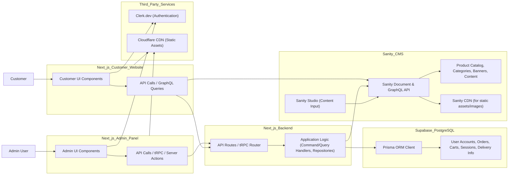
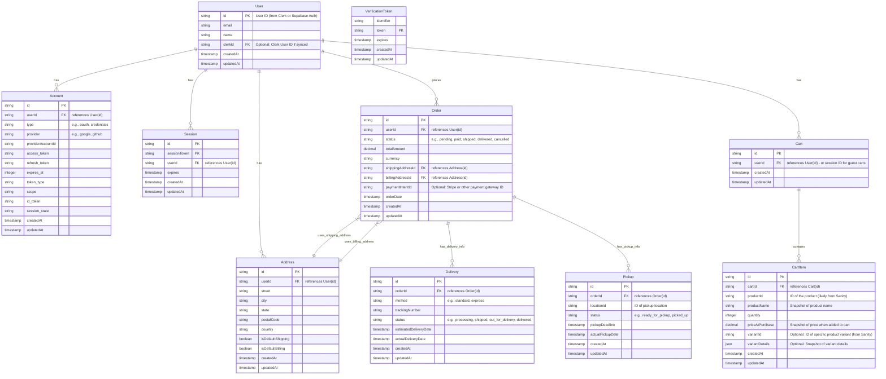

# System Diagram Descriptions

This document provides textual descriptions that can be used as a basis for generating visual system diagrams (e.g., using Mermaid.js or other diagramming tools).

## 1. System Architecture Diagram Description

This diagram outlines the major components of the E-Commerce platform and their interactions.



**Explanation of Components and Flows (System Architecture):**

*   **Users:**
    *   `Admin User`: Interacts with the Admin Panel.
    *   `Customer`: Interacts with the Customer Website.
*   **Frontend Systems:**
    *   **Next.js Admin Panel:** Interface for administrators, making backend calls (current REST-like, suggested tRPC/Server Actions).
    *   **Next.js Customer Website:** Public store interface, fetching data via GraphQL from Sanity or backend APIs for actions.
*   **Backend Services & Data Stores:**
    *   **Next.js Backend Logic:** Handles API requests, contains business logic (command/query handlers, repositories).
    *   **Sanity Headless CMS:** Manages product catalog and content, accessed via Document and GraphQL APIs. Includes Sanity Studio for content input and a CDN.
    *   **Supabase - PostgreSQL Database:** Stores transactional data (orders, carts), user accounts, sessions, etc., accessed via Prisma.
    *   **Third-Party Services:** Clerk.dev for authentication, Cloudflare for CDN.
*   **Connections:** Illustrates data flow between users, frontends, backend logic, data stores, and services.


## 2. Database Diagram Description (Supabase/PostgreSQL - Conceptual)

This conceptual diagram describes the likely structure and relationships for the PostgreSQL database managed via Supabase, based on the models listed in the README.



**Explanation of Entities and Relationships (Database - Conceptual):**

*   **User:** Core user entity, potentially linked to Clerk or Supabase Auth.
*   **Account:** For OAuth account linking (e.g., via NextAuth.js).
*   **Session:** Manages user sessions (e.g., via NextAuth.js).
*   **VerificationToken:** For email verification tokens.
*   **Address:** Stores user shipping and billing addresses.
*   **Order:** Represents a customer's order, linked to a user, addresses, and potentially delivery/pickup info.
*   **Cart:** User's shopping cart, containing cart items.
*   **CartItem:** An item in the cart, referencing product details (which live in Sanity) and snapshotting price/name.
*   **Delivery:** Shipping details for an order.
*   **Pickup:** Pickup details for an order.

**Note:** This database model is conceptual. `OrderItem`s are typically generated from `CartItem`s at purchase but not explicitly listed in the provided models. Product details in `CartItem` reference the main product data in Sanity.
```
